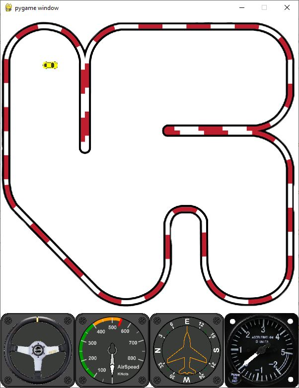

# carSim
Simple 2D car simulator. Demostrating a state-space model of the car with non-linear behavior.
In addition, demonstrating the usage of GSOF_Cockpit library (not as a sub module).

Requires Python and pyGame to run.

http://python.org/

http://www.pygame.org

## Running instructions

- Clone
- Install requirements `pip install -r requirements.txt`
- run `simulator_desktop.py`

`Keys:`

`p` , `i` - Increase steering to the car left or right

`q` - Increase thrust

`z` - Reduce thrust

`a` - Neutral

`space` - immediate stop
